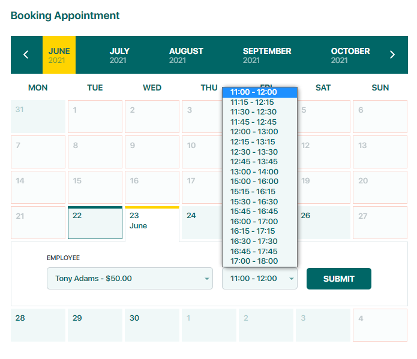

# Main Settings

After successfully installing the **BookIt Google Calendar** add-on, all the Google Calendar settings will be available in the path of **Dashboard > BookIt Calendar > Settings** menu. Simply toggle on the switch to expand the add-on functionalities.

.png>)

All settings of the BookIt Google Calendar add-on are available after toggling on the switch.

.png>)

.png>)

## Synchronization with pending appointments

The BookIt Google Calendar add-on synchronizes only approved and canceled appointments to the staff. By default, appointments created on the site by customers get the **Pending** status.


Get more detailed information about the **statuses** of the appointments on the [Appointments](../plugin-features/approve-reject-and-edit-appointments.md) page of this manual.


.png>)

The appointment status switches to **Approved** only after confirmation by the admin.

.png>)

&#x20;If the **Synchronization with pending appointments** option enabled, the appointments created by clients as well as appointments created by admin with Pending status will be also synchronized with the Stuff's Google Calendar which performing the appointment.

.png>)


**Important!**

The staff should be connected to the Google Calendar to see pending appointments. Get more information about the staff connection process to Google Calendar in [Connect Staff to Google Calendar](template.md) page of this manual.


## Consider Google **C**alendar busy slots for customers

The staff can have several appointments made on Google Calendar.

.png>)

By enabling the **Consider Google Calendar busy slots for customers** option, the BookIt add-on checks the staff's availability on the selected day in Google Calendar before displaying free time slots.

.png>)

The staff's busy slots in Google Calendar will be removed from the list of available time slots.

On the admin side, a notification will be displayed to the admin that the staff is busy at the specific time slot with an event in the Google Calendar.

.png>)

But admin has the access to create an appointment under the staff's busy time slot in Google Calendar.


**Important!**

The staff should be connected to the Google Calendar. Get more information about the staff connection process to Google Calendar in [Connect Staff to Google Calendar](template.md) page of this manual.


## Add customer as event attendees

The Customer leaves the email and phone number by creating an event on Google Calendar.

.png>)

By enabling the **Add customer as event attendees** option, by creating the event on Google Calendar, the email of the client will be added to the event as an attendee.

.png>)

## Templates

The **Title** and **Body** in the template is the order by displaying event on the Google Calendar.

.png>)

.png>)

## Export Appointments

The **Export Appointments** option allows synchronizing all the upcoming events with Google Calendar of the staff.

.png>)


**Important!**

The staff should be connected to the Google Calendar. Get more information about the staff connection process to Google Calendar in [Connect Staff to Google Calendar](template.md) page of this manual.

