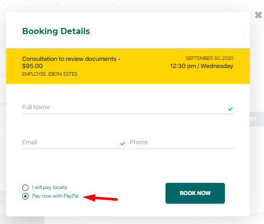
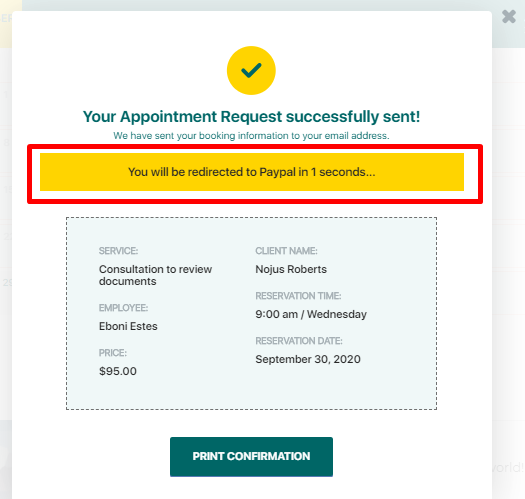
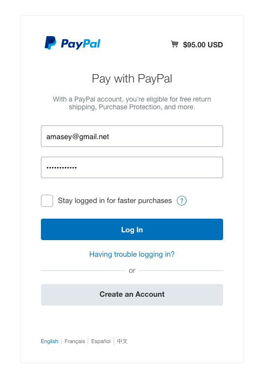
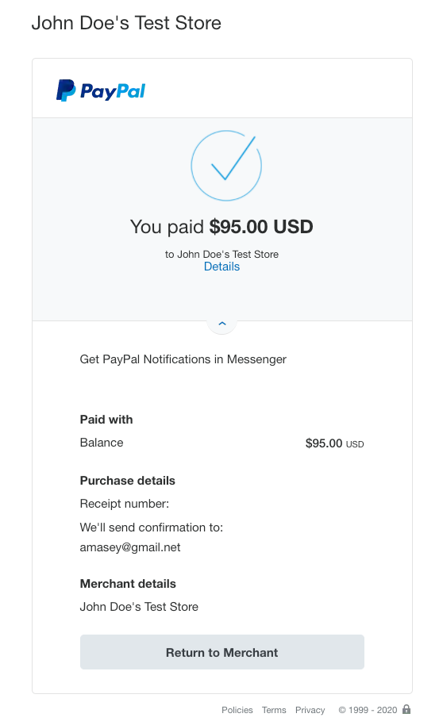
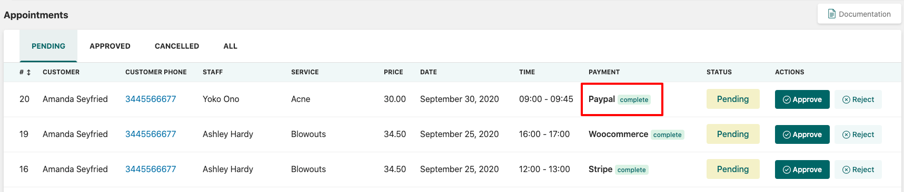

# PayPal

To enable PayPal as a payment method for bookings follow **BookIt Calendar > Settings > Payments** and **Enable** PayPal.&#x20;

.png>)

You need to provide a PayPal email & PayPal mode


For the correct PayPal performance, you need to set up[ IPN Listener Settings](https://developer.paypal.com/docs/api-basics/notifications/ipn/IPNSetup/).


When submitting the booking, select PayPal as a payment method - mark the option **Pay now with PayPal**.&#x20;

After clicking on Book Now customers will get a request confirmation and will be redirected to PayPal.&#x20;

The customer will need to log in to PayPal and proceed to checkout.&#x20;

If the payment completed successfully there will be a popup notification with the purchase details.&#x20;

On the admin panel, the payment status will be marked as **Complete**.


If there was used **PayPal Sandbox** for payment, the status will remain as **Pending**.


