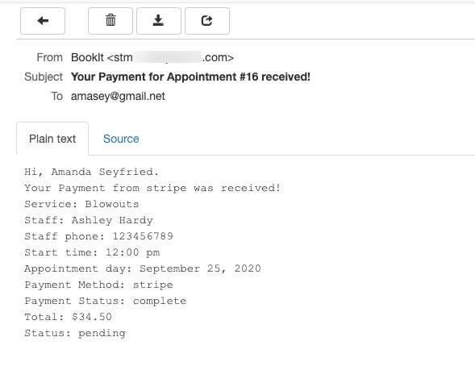

# Stripe

To use **Stripe** as a payment method for appointments, go to **BookIt Calendar > Settings > Payments**.\
Enable Stripe and enter **Stripe Publish Key** and **Stripe Secret key.**


You can create a Stripe account on the official website of [Stripe](https://stripe.com/).


To collect the keys you need to log in to the Stripe site. All the keys are available on the Home page of your Dashboard.&#x20;

In order to get the test key, follow **Dashboard > Get your test API keys**, and to get the live keys, go to **Dashboard > Get your live API keys**.

Copy your Keys and paste them to the required fields under the **Payments** tab.

When customers are booking the appointment they need to select **Pay now with Credit Card** option and click **Book Now**.

After the successful appointment request, customers will get a similar email message, where all the booking details can be found:

The admin will also get an email notification:

If you follow to **Dashboard > Bookit Calendar > Appointments** you will see that the payment status has changed automatically.


Please note that all transactions are managed by **Stripe**.


After payment is received, the appointment can be managed by the admin, who needs to **Approve** it.&#x20;
