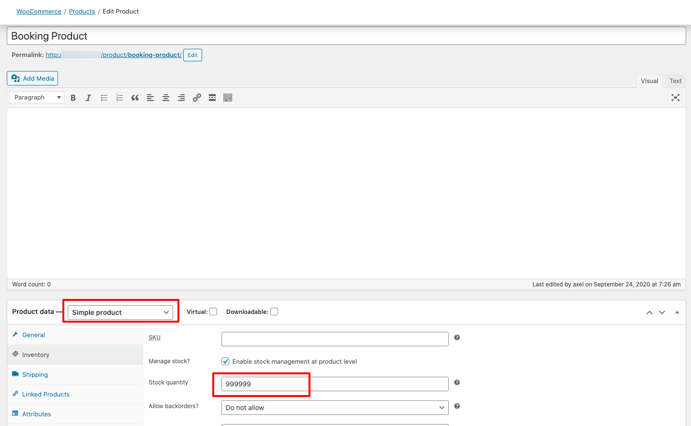
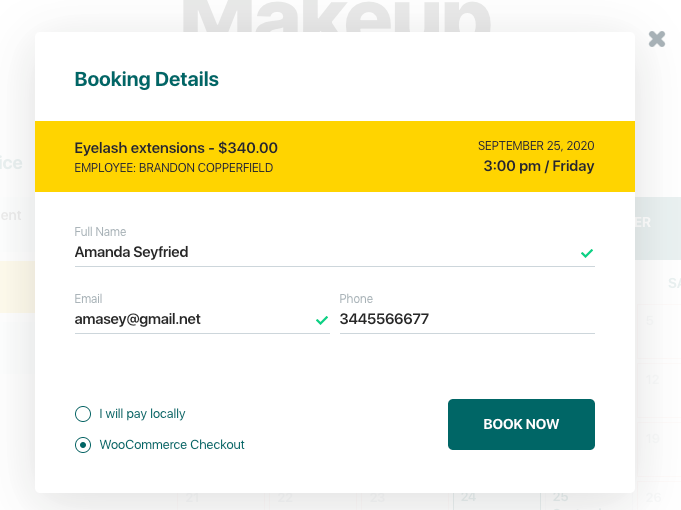
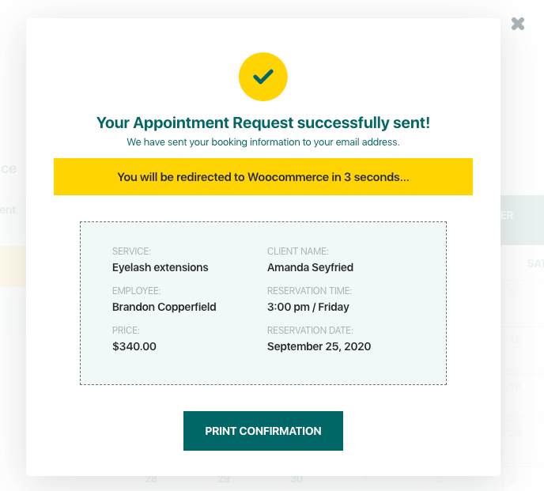
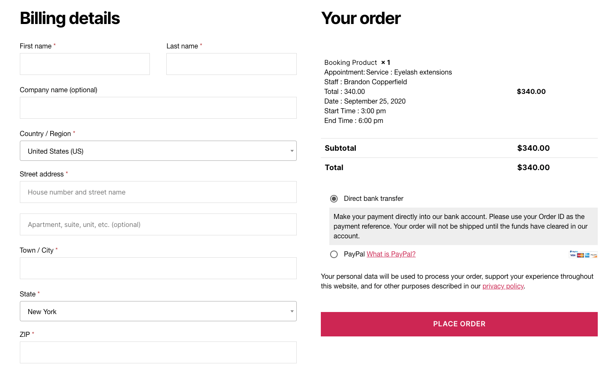
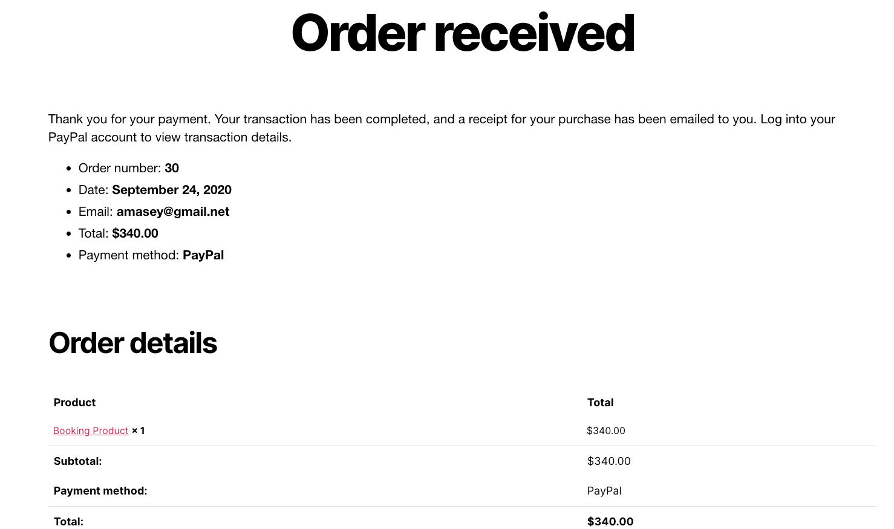
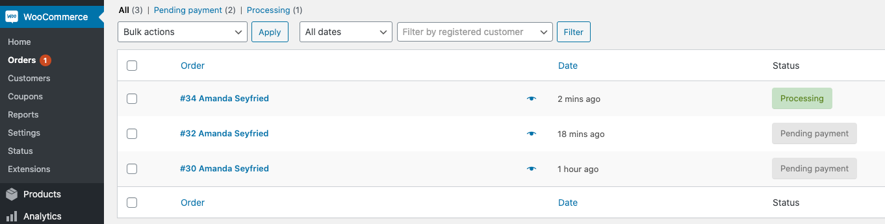
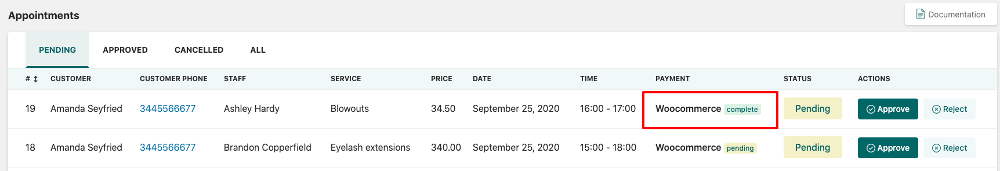

# WooCommerce

If you’d like to use WooCommerce as a payment method, enable WooCommerce under the payment tab in the **BookIt Calendar** Settings.&#x20;

You will need to specify the WooCommerce product for it. You can create one WooCommerce product for all services and specified it in the BookIt Calendar settings. Just select it from the dropdown under the **WooCommerce Product** title.


The instructions above consider that the WooCommerce plugin is already set up on your site. If not, please follow the WooCommerce instructions here: [https://docs.woocommerce.com/documentation/plugins/woocommerce/getting-started/](https://docs.woocommerce.com/documentation/plugins/woocommerce/getting-started/)


For the services, you can create one Simple Product and set the maximum number for the Stock quantity as all services will be checked out through this product.\
For the product's price specify any number, except 0. The price of the service will be applied automatically.&#x20;

When booking appointments, customers will need to select the **WooCommerce Checkout** option.

After appointment submission, the customer will be redirected to the WooCommerce checkout page.&#x20;

After that, the customer will be required to fill in all the fields and select the payment method.&#x20;


The design of the checkout page and the display of the fields fully depend on the site's active Theme. For example, on the screenshot below we used the TwentyTwenty WP theme.



All the methods available for WooCommerce can be used. The BookIt Calendar plugin does not control payments.&#x20;


After the successful payment, the customer will be redirected to the Default Order Received page.

Admin can check the order details in **WooCommerce > Orders**.


All offline payment methods and PayPal Sandbox require the admin to change the payment methods manually in orders.&#x20;


After successful payment, the admin has to approve the appointment manually.

