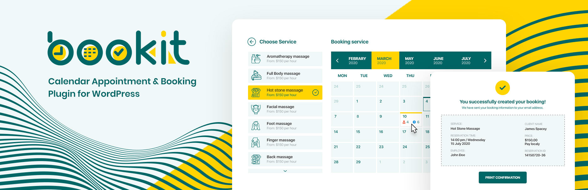

# Free version & Pro Add-ons

The BookIt Calendar is a free WordPress plugin available for download on wordpress.org. The **free version** of the plugin includes all the major features and options. Find more information on the [plugin page](https://wordpress.org/plugins/bookit/).&#x20;

The **Pro add-ons** extend the possibilities of the plugin thanks to two additional add-ons that are available on our [official page](https://stylemixthemes.com/wordpress-appointment-plugin/).

* [BookIt Payments](../boolit-payments/stripe.md) – Allows setting up additional payment options such as Stripe, PayPal, and WooCommerce.
* [BookIt Google Calendar](../bookit-google-calendar/google-api.md) – Allows linking the plugin to the Google Calendar.
