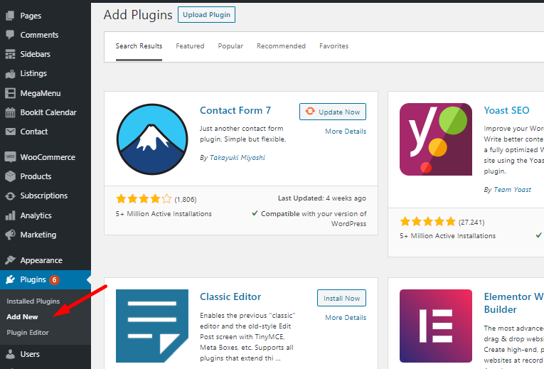
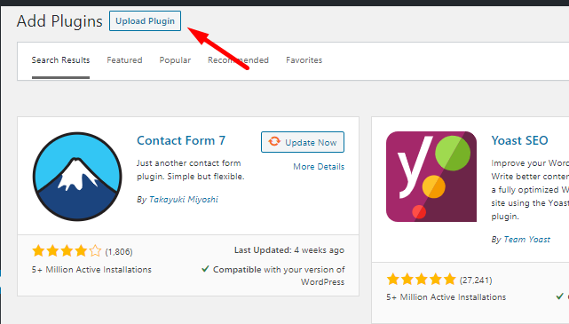
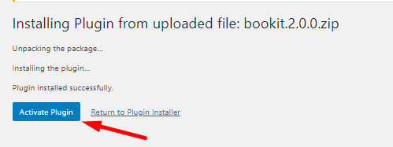
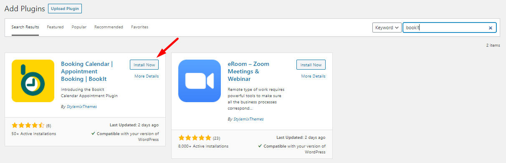
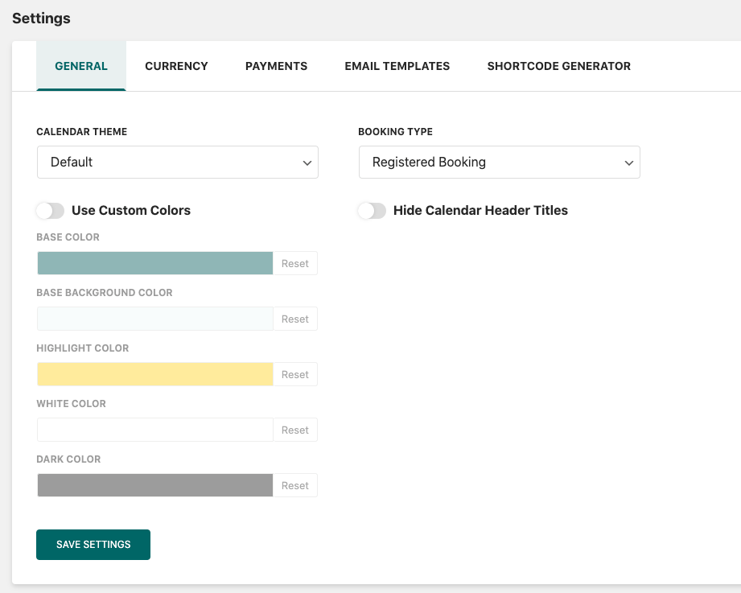

# Plugin Installation

## Installation of the Free Version

To install the BookIt plugin you need to download the file from wordpress.org.&#x20;


Also, you can extend the functionality of the BookIt Calendar by getting the **Pro Add-ons** of the plugin. The **Pro Add-ons** are available on our [official website](https://stylemixthemes.com/wordpress-appointment-plugin/).


Download the plugin archive file here [https://wordpress.org/plugins/bookit/](https://wordpress.org/plugins/bookit/) and follow to **Plugins > Add** **New** from your dashboard.&#x20;

Click on the **Upload Plugin** button and select the BookIt file. Click **Install Now** and wait for the installation to finish.&#x20;

After the installation, you need to **activate** the plugin and you can start working.&#x20;

Also, you can install the plugin right from your **dashboard**.

Follow **Plugins > Add new**, use the search panel, and search for the BookIt Calendar plugin.&#x20;

Click **Install** and after installation **Activate** the plugin. It is required to opt into freemius services after plugin activation.

.png>)

## Installation of the Pro Add-ons&#x20;

To install the Pro BookIt Calendar Add-ons you need to get a paid version of the plugin here: [https://stylemixthemes.com/wordpress-appointment-plugin/](https://stylemixthemes.com/wordpress-appointment-plugin/)


Make sure you have the **BookIt** plugin basic free version is installed and activated before installing the Pro Add-ons.


After purchasing the add-ons you will get an email from Freemius with the link to the add-on zip package, your license code, and instructions on how to set up BookIt Calendar.

Once you get the package, follow to **Plugins > Add new** and upload the zip file. Click **Install Now** and wait for the installation to finish.

.png>)

.png>)

When the plugin is installed you need to **Activate** it.

.png>)

After clicking on **Activate Plugin**, you will be redirected to another page to activate your license. Use the License Key you received with your email and enter it in the field provided.&#x20;

.png>)

Click **Agree & Activate License** to confirm the activation.

After the activation, you will be redirected to the plugin's **Settings** page.

