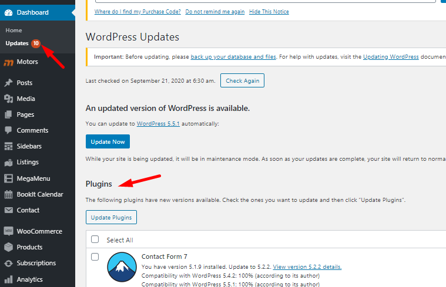

# Update The Plugin

We constantly improve our products and release regular updates. All updates are available for free.

To update the BookIt Calendar plugin, go to **Dashboard > Updates**.

In the **Plugins** section find **BookIt Calendar**, mark it, and click Update Plugins.

Also, you can open the **Installed Plugins** page (**Plugins > Installed Plugins**) and update the plugin there. Find BookIt Calendar in the list and click **Update Now** if there is an update available.

