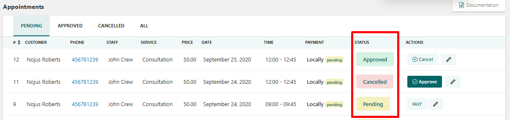

# Approve, Reject, Edit, and Delete appointments

In the **Actions** column, you can find three options you can use: **Approve**, **Reject**, **Edit, Delete**.

**Approve** confirms the appointment, **Reject** cancels the appointment, **Edit** allows you to change the arrangement details, and **Delete** allows you to delete appointment(s).

.png>)

Depending on the action taken — **Approve** or **Rejecte** — the appointment status will be changed automatically to **Approved** or **Canceled**.

### **Editing the Appointment**

By clicking on the Edit icon you will open a new popup with the arrangement data. Here you can change the major part of appointment details in spite of the customer name:

You can edit appointment details such as service, staff, status, date, and time of the reservation.

.png>)

As an admin, you can edit the appointment payment details too:

.png>)


Only appointments created a few minutes ago can be edited. The appointments in the past cannot be edited since they are strictly considered for reservation.


Canceled appointments can be changed to **Approved** status and then they can be edited.

### Deleting Appointment

You need to click the bin icon to delete an appointment

.png>)

The pop-up module will appear to send a notification message to the client/staff. You may enable the checkbox for the employee or customer or for both to send an informative message to their emails. You can insert the reason for the appointment cancellation.

.png>)

The reason for cancellation will be sent to the user you set up while appointment deletion.

.png>)
