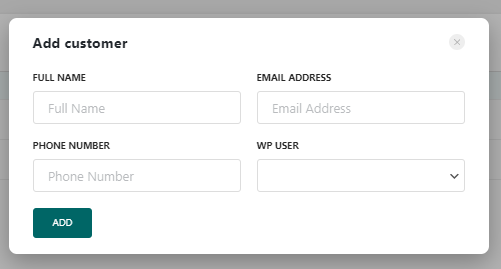

# Customers

On the **BookIt Calendar > Customers** page you can find all the customers registered on your website, who booked an appointment.&#x20;

By clicking on the **Add New** button you can add a new customer.

Enter the information about the customer which includes full name, email address, and phone number. And select the option for WP User.

Click **Add** to save changes and add a new customer.&#x20;

You can edit the customers' info by clicking on the Edit icon ad changing the details.&#x20;

Or you can also delete the customer.

