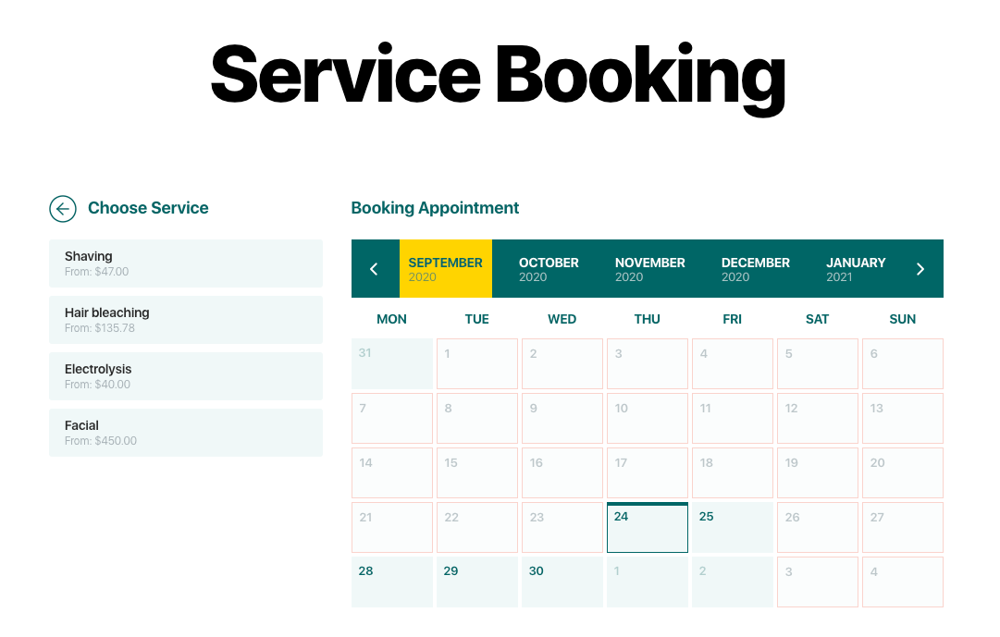
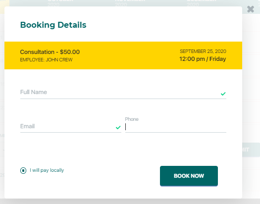
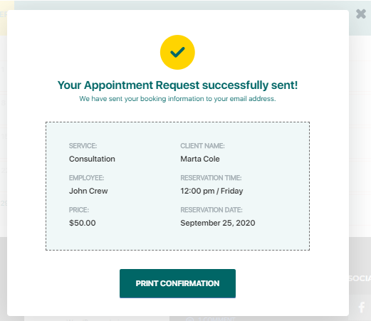

# How to book an appointment

When the calendar is ready and you added it to the page, your customers will get a similar view:

### **How to book an appointment**

To submit a booking users need to select the date and click on this day on the calendar.

After that, they will have to specify the employee and the time for the appointment (select from the dropdown).

And click the **Submit** button.&#x20;

In the new popup, customers need to provide personal information such as full name, email, phone and select the payment method between the options available on site. For the registered type of booking, customers will also be required to enter the password of their account.

When customers click on Book Now they will get a notification with confirmation/ The booking information will be sent to the customer's email. Also, they can print out the confirmation by clicking on the Print Confirmation option.&#x20;

The appointment request will be updated after approvement or rejection, any updates will be specified via email. &#x20;

