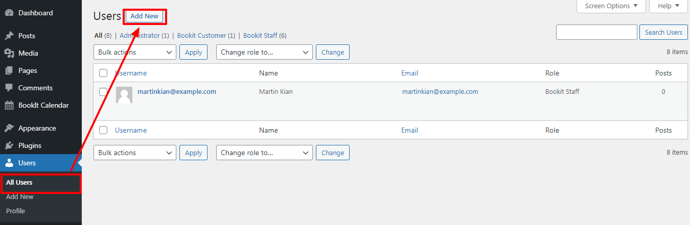
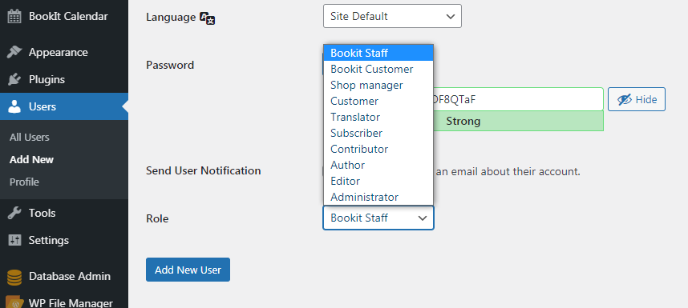

# Staff

## **Adding New Staff members**

The plugin allows you to add staff members that provide one or more services presented on the website. To open the **Staff** settings follow **BookIt Calendar > Staff**.\

To add a new member of the staff click **Add new** next to the searching line.&#x20;

In the popup, you will need to enter the information about the new member.&#x20;

Add staff screen consists of three parts: **Details,** **Services**, **Working hours**. Click on the arrow icon to expand or close the specific section.

.png>)

### Details

For the **Details** section, you need to provide the name, email, phone number, and WP User account of the staff member.


The detailed information about the **WP User** field written on the Assign staff as a user section of this page.


.png>)

### Services

For **Services,** you need to select the services the person will be providing. Simply mark the needed option, you can select more than one. For the selected services you can also change the price. \

### Working Hours

In **Working Hours** specify the working schedule, choose the time from the dropdown, or mark the day as a day off.&#x20;

On the Staff page, you can easily access all the staff members. The list displays all the information. In addition, you can edit and delete any of the members.&#x20;

When you are editing the staff details, you can apply changes to his personal data (name, email, phone number), services he provides, and the working hours he works.

.png>)

When you are editing the working hours of staff, the notification message will appear saying "_Changing of the Staff working hours will not affect the existing appointments and will be applied only to new appointments_"

.png>)

When finished, click **Save** to save the changes.

## Assign Staff as a User

Each created staff should own their profile where they can log in to the dashboard and manage their appointments. For this reason, the **WP User** field is available that the admin can assign the existing user as a staff or create a new user.

.png>)

The staff assignment can be done in two ways, directly from the staff's details panel or from the Users section of the Dashboard.&#x20;

### New WP User

Click the **New WP User** button to add a new user.

.png>)

Afterward, set the WP User email and password for the staff and click the **Add** button.

.png>)

Now, the username and the password assigned for the staff. Click the **Save** button to save the changes.

.png>)

### Users menu

The user can be created on the path of **Dashboard > Users** to assign them after as a WP User in the plugin. Click the **Add New** button in the Users menu.

Fill the required fields according to staff information.

.png>)

It is important to choose the **Bookit Staff** in the **Role** field.

Click the **Add New User** field after filling all the fields.

Afterward, the created user details appear by assigning the WP User to the staff.

.png>)

## The Staff Profile

The staff can log in to their profile through created username and password by the admin.

.png>)

They can edit all the information connected to their Bookit profile by clicking the **Edit** button.

.png>)

Or they set a new password on the Profile menu.

.png>)
