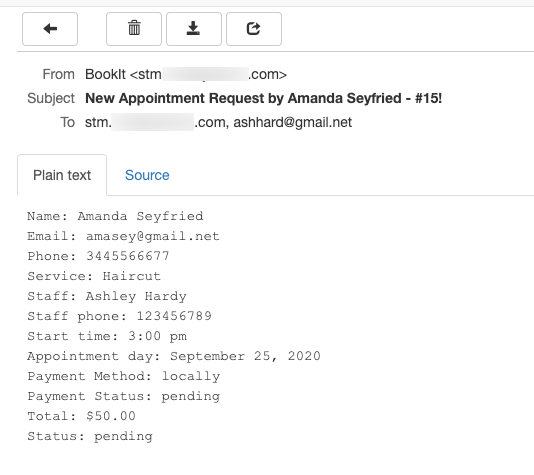
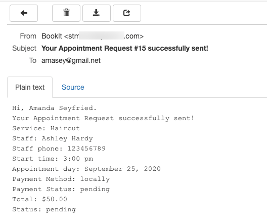

# Email Templates

Email templates allow you to prepare email notifications for various activities on the website. You can adjust the message template of the following activities:

* **New Appointment** - when a new appointment is created
* **Appointment Updated** - when the particular appointment is updated after request
* **Payment Complete** - when the payment for an appointment is successfully finished
* **Appointment Status Changed** - when the user requests to change the appointment status
* **Delete Appointment** - when an appointment is deleted

.png>)

You can set up the templates for both **admin** and **customers**. Just **Enable Customer Notifications** and **Admin Notifications**.

Email notifications can be created for the **New Appointment**, **Appointment Updated**, **Payment Complete**, **Appointment Status Changed**.&#x20;

For each template, you can specify the **Subject** and **Message body**. Admin notification also allows you to include **Recipients**. There are various shortcodes provided that you can add to the message content.&#x20;

Click on the shortcode to add to the message.

Below is the example of an email that will receive the website admin and a staff member that admin added as a recipient:

And an example of the email that a customer receives after booking an appointment:&#x20;

